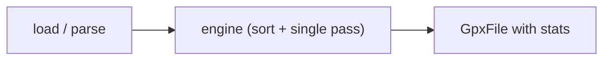

# Statistics

Statistics are calculated by `engine`. Models (`Track`, `Segment`, `Route`) are pure data containers — they do not calculate stats themselves.

## Enabling statistics

```php
use phpGPX\phpGPX;
use phpGPX\Analysis\Engine;

$gpx = new phpGPX(engine: Engine::default());

$file = $gpx->load('track.gpx');
```

Without `engine`, `$track->stats`, `$segment->stats`, and `$route->stats` will all be `null`.

## Available statistics

The `Stats` object provides:

| Property | Type | Analyzer |
|----------|------|----------|
| `distance` | float | `DistanceAnalyzer` — 2D ground distance in meters |
| `realDistance` | float | `DistanceAnalyzer` — 3D distance including elevation |
| `averageSpeed` | float | Derived — distance / duration (m/s) |
| `averagePace` | float | Derived — duration / distance (s/km) |
| `minAltitude` | float | `AltitudeAnalyzer` — minimum elevation in meters |
| `maxAltitude` | float | `AltitudeAnalyzer` — maximum elevation in meters |
| `cumulativeElevationGain` | float | `ElevationAnalyzer` — total ascent in meters |
| `cumulativeElevationLoss` | float | `ElevationAnalyzer` — total descent in meters |
| `startedAt` | DateTime | `TimestampAnalyzer` — first non-null timestamp |
| `finishedAt` | DateTime | `TimestampAnalyzer` — last non-null timestamp |
| `duration` | float | Derived — finishedAt - startedAt (seconds) |
| `bounds` | Bounds | `BoundsAnalyzer` — lat/lon bounding box |
| `movingDuration` | float | `MovementAnalyzer` — time in motion (seconds) |
| `movingAverageSpeed` | float | Derived — distance / movingDuration (m/s) |
| `averageHeartRate` | float | `TrackPointExtensionAnalyzer` — avg HR (bpm) |
| `maxHeartRate` | float | `TrackPointExtensionAnalyzer` — peak HR (bpm) |
| `averageCadence` | float | `TrackPointExtensionAnalyzer` — avg cadence (rpm) |
| `averageTemperature` | float | `TrackPointExtensionAnalyzer` — avg temp (C) |

Coordinate properties: `startedAtCoords`, `finishedAtCoords`, `minAltitudeCoords`, `maxAltitudeCoords` — each an array with `lat` and `lng` keys.

## Accessing statistics

```php
use phpGPX\phpGPX;
use phpGPX\Analysis\Engine;

$gpx = new phpGPX(engine: Engine::default());
$file = $gpx->load('track.gpx');

foreach ($file->tracks as $track) {
    $stats = $track->stats;

    echo "Distance: " . round($stats->distance) . " m\n";
    echo "Real distance: " . round($stats->realDistance) . " m\n";
    echo "Elevation gain: " . round($stats->cumulativeElevationGain) . " m\n";
    echo "Duration: " . gmdate("H:i:s", $stats->duration) . "\n";
    echo "Average speed: " . round($stats->averageSpeed * 3.6, 1) . " km/h\n";

    // Per-segment stats
    foreach ($track->segments as $i => $segment) {
        echo "  Segment $i: " . round($segment->stats->distance) . " m\n";
    }
}
```

## The engine

The engine walks the GPX structure **once** and dispatches each point to all registered analyzers in a single pass. No redundant iteration.

### Quick start with defaults

```php
$gpx = new phpGPX(engine: Engine::default());
```

### Customizing via the factory

```php
$gpx = new phpGPX(engine: Engine::default(
    sortByTimestamp: true,
    applyElevationSmoothing: true,
    elevationSmoothingThreshold: 2,
    ignoreZeroElevation: true,
    speedThreshold: 1.0,            // m/s for movement detection
));
```

### Building manually

For fine-grained control, register only the analyzers you need:

```php
use phpGPX\Analysis\Engine;
use phpGPX\Analysis\DistanceAnalyzer;
use phpGPX\Analysis\ElevationAnalyzer;
use phpGPX\Analysis\TimestampAnalyzer;

$engine = (new Engine(sortByTimestamp: true))
    ->addAnalyzer(new DistanceAnalyzer())
    ->addAnalyzer(new ElevationAnalyzer(applySmoothing: true))
    ->addAnalyzer(new TimestampAnalyzer());

$gpx = new phpGPX(engine: $engine);
```

## Built-in analyzers

### DistanceAnalyzer

Computes raw (2D) and real (3D) distance via the Haversine formula.

```php
new DistanceAnalyzer(
    applySmoothing: true,     // filter GPS jitter
    smoothingThreshold: 2,    // meters — ignore movements below this
)
```

### ElevationAnalyzer

Computes cumulative elevation gain and loss.

```php
new ElevationAnalyzer(
    ignoreZeroElevation: true,          // treat 0 as missing data
    applySmoothing: true,               // filter noise
    smoothingThreshold: 2,              // meters — minimum change to count
    spikesThreshold: 50,                // meters — maximum change to count
)
```

### AltitudeAnalyzer

Finds minimum and maximum altitude with coordinates.

```php
new AltitudeAnalyzer(ignoreZeroElevation: true)
```

### TimestampAnalyzer

Records first and last non-null timestamps with coordinates. Duration, speed, and pace are derived by the engine.

### BoundsAnalyzer

Computes lat/lon bounding box at segment, track, and file level. File-level bounds include waypoints.

### MovementAnalyzer

Detects movement vs stopped intervals based on instantaneous speed.

```php
new MovementAnalyzer(speedThreshold: 1.0)  // 3.6 km/h — walking pace
```

### TrackPointExtensionAnalyzer

Aggregates Garmin TrackPointExtension sensor data (heart rate, cadence, temperature).

## Standalone usage

You can also use `engine` directly on a `GpxFile` you built programmatically:

```php
$gpxFile = Engine::default()->process($gpxFile);
```

## Full example

```php
use phpGPX\phpGPX;
use phpGPX\Analysis\Engine;

$gpx = new phpGPX(engine: Engine::default(
    sortByTimestamp: true,
    applyElevationSmoothing: true,
    elevationSmoothingThreshold: 2,
));

$file = $gpx->load('track.gpx');
```

