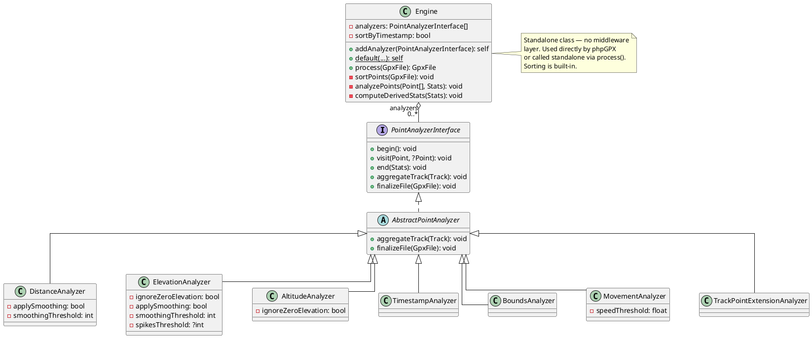
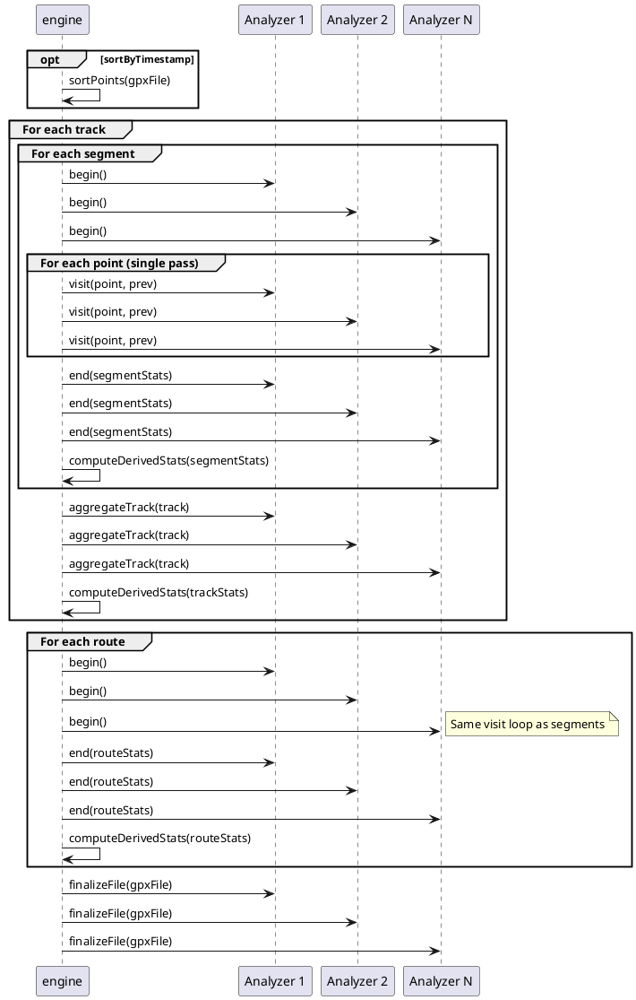
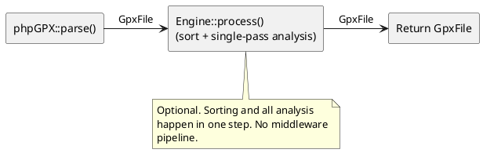

# Stats Architecture: Single-Pass Analyzer Engine

## Overview

phpGPX 2.x uses a **single-pass analyzer engine** for computing GPS statistics.
A single `engine` walks the GPX structure once and dispatches each point to all
registered analyzers simultaneously.

## Class Diagram



## Lifecycle Sequence



## How It Fits in phpGPX



## Built-in Analyzers

| Analyzer                      | Computes                                                   | Config                                                                           |
|-------------------------------|------------------------------------------------------------|----------------------------------------------------------------------------------|
| `DistanceAnalyzer`            | Raw distance, real distance, per-point difference/distance | `applySmoothing`, `smoothingThreshold`                                           |
| `ElevationAnalyzer`           | Cumulative elevation gain/loss                             | `ignoreZeroElevation`, `applySmoothing`, `smoothingThreshold`, `spikesThreshold` |
| `AltitudeAnalyzer`            | Min/max altitude with coordinates                          | `ignoreZeroElevation`                                                            |
| `TimestampAnalyzer`           | Start/end timestamps with coordinates                      | —                                                                                |
| `BoundsAnalyzer`              | Lat/lon bounding box (segment, track, file)                | —                                                                                |
| `MovementAnalyzer`            | Moving duration, moving average speed                      | `speedThreshold`                                                                 |
| `TrackPointExtensionAnalyzer` | HR, cadence, temperature averages/max                      | —                                                                                |

**Derived stats** (computed by the engine after all analyzers finish):
- Duration = finishedAt - startedAt
- Average speed = distance / duration
- Average pace = duration / (distance / 1000)
- Moving average speed = distance / movingDuration

## Extending with Custom Analyzers

To add a new statistic, extend `AbstractPointAnalyzer`:

```php
use phpGPX\Analysis\AbstractPointAnalyzer;
use phpGPX\Models\Point;
use phpGPX\Models\Stats;
use phpGPX\Models\Track;

class MaxSpeedAnalyzer extends AbstractPointAnalyzer
{
    private float $maxSpeed = 0;

    public function begin(): void
    {
        $this->maxSpeed = 0;
    }

    public function visit(Point $current, ?Point $previous): void
    {
        if ($previous === null || $previous->time === null || $current->time === null) {
            return;
        }

        $timeDelta = abs($current->time->getTimestamp() - $previous->time->getTimestamp());
        if ($timeDelta === 0) return;

        $distance = \phpGPX\Helpers\GeoHelper::getRawDistance($previous, $current);
        $speed = $distance / $timeDelta;

        if ($speed > $this->maxSpeed) {
            $this->maxSpeed = $speed;
        }
    }

    public function end(Stats $stats): void
    {
        // Write to stats (you may need to add a custom field or use extensions)
    }

    public function aggregateTrack(Track $track): void
    {
        // Find max across segments
    }
}
```

Then register it:

```php
$engine = Engine::default();
$engine->addAnalyzer(new MaxSpeedAnalyzer());
```
